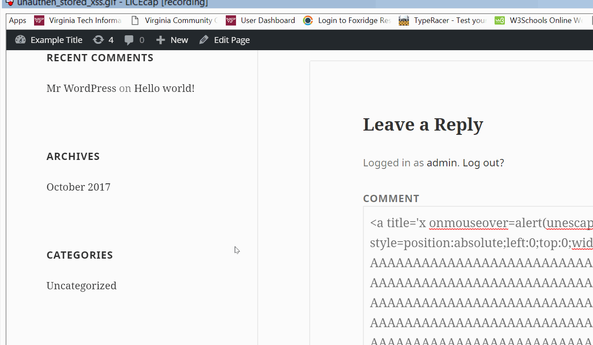
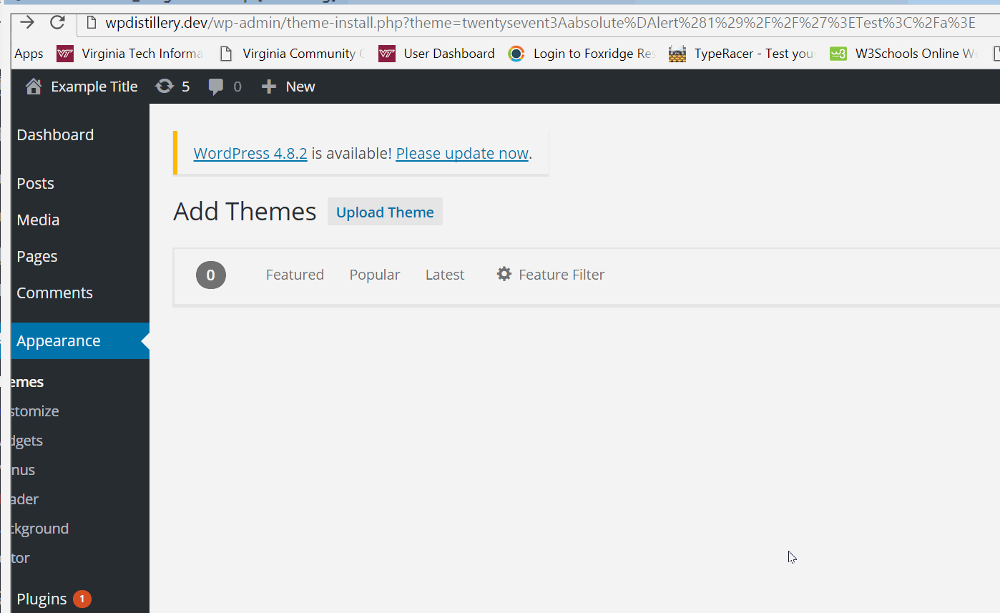

# Project 7 - WordPress Pentesting

Time spent: **8** hours spent in total

> Objective: Find, analyze, recreate, and document at least **three vulnerabilities** affecting an old version of WordPress

## Pentesting Report

1. WordPress <= 4.2 - Unauthenticated Stored Cross-Site Scripting (XSS)
  - [x] Summary: 
    - Vulnerability types: Cross-Site Scripting
    - Tested in version: 4.2
    - Fixed in version: 4.2.1
  - [x] GIF Walkthrough: 
    - 
  - [x] Steps to recreate: 
    - Log in to WPDistillery as Admin
    - Click 'Pages' in the left navigation bar
    - Hover over 'Example Front Page', and press 'View' when it appears
    - Scroll down to 'Leave a Reply' box
	- Add **** (64 kb implies that there needs to be more than 64 kb of A's) to the comment box
    - Profit
  - [x] Affected source code:
    - N/A
2. WordPress 4.2-4.5.1 - MediaElement.js Reflected Cross-Site Scripting (XSS)
  - [x] Summary: 
    - Vulnerability types: Cross-Site Scripting
    - Tested in version: 4.5.1
    - Fixed in version: 4.5.2
  - [x] GIF Walkthrough: 
    -  
  - [x] Steps to recreate: 
    - Log in to WPDistillery as Admin
    - Enter <https://example.com/wp-includes/js/mediaelement/flashmediaelement.swf?jsinitfunctio%gn=alert`1`> (the syntax in this link bypasses flash media element swf functions) into browser
    - Profit
  - [x] Affected source code:
    - [Link 1](https://github.com/WordPress/WordPress/commit/a493dc0ab5819c8b831173185f1334b7c3e02e36)
3. WordPress 3.6.0-4.7.2 - Authenticated Cross-Site Scripting (XSS) via Media File Metadata
  - [x] Summary: 
    - Vulnerability types: Cross-Site Scripting
    - Tested in version: 4.5.3
    - Fixed in version: 4.7.3
  - [x] GIF Walkthrough: 
    - 
  - [x] Steps to recreate: 
    -  Log in to WPDistillery as Admin
    -  Click on 'Media' button in left navigation bar
    -  Click on 'Add New' button next to 'Media Library' header to add new file
    -  Add downloaded xss.mp3 file to library
    -  Click on 'Post' button in left navigation bar
    -  Click on 'Add New' button next to 'Posts' header to create new post
    -  Click on the 'Add Media' button
    -  Click on 'Create Audio Playlist' button in the left navigation bar
    -  Select the newly added xss.mp3 file, then click on the 'Create a new playlist' in the bottom right corner
    -  Click on the 'Insert audio playlist' button in the bottom right corner
    -  Profit
  - [x] Affected source code:
    - [Link 1](https://github.com/WordPress/WordPress/commit/28f838ca3ee205b6f39cd2bf23eb4e5f52796bd7)

## Assets

- xss.mp3 file used for exploit 3

## Resources

- [WordPress Source Browser](https://core.trac.wordpress.org/browser/)
- [WordPress Developer Reference](https://developer.wordpress.org/reference/)

GIFs created with [LiceCap](http://www.cockos.com/licecap/).

## Notes

- Somewhat of a struggle to familiarize myself with the WordPress UI, especially since familiarity is required to be able to exploit the site

## License

    Copyright 2017 The Apache Software Foundation

    Licensed under the Apache License, Version 2.0 (the "License");
    you may not use this file except in compliance with the License.
    You may obtain a copy of the License at

        http://www.apache.org/licenses/LICENSE-2.0

    Unless required by applicable law or agreed to in writing, software
    distributed under the License is distributed on an "AS IS" BASIS,
    WITHOUT WARRANTIES OR CONDITIONS OF ANY KIND, either express or implied.
    See the License for the specific language governing permissions and
    limitations under the License.